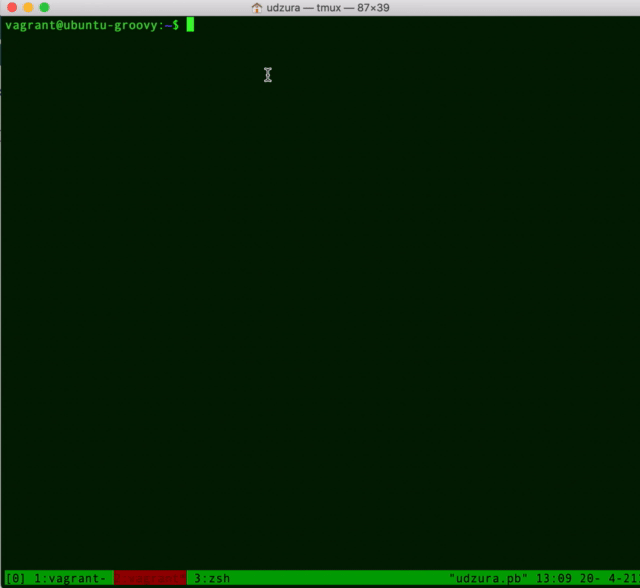

# container-tracers
container tracers/debuggers using eBPF

## `constat`

* Show statistics of system call by container. "Container" is specifyed by cgroup v2.

```console
$ sudo constat -c $CGDIR
Collecting events... Ctrl-C to stop and show stat
^C
SYSCALL           COUNT    (%) ELAPSED(ms)    (%)
read              24681 17.39%    2208.344  7.23%
write             12930  9.11%     902.914  2.96%
close             12486  8.80%       6.725  0.02%
openat            10807  7.61%      77.689  0.25%
lseek              9278  6.54%       4.304  0.01%
fstat              8583  6.05%       9.970  0.03%
mmap               8283  5.84%      20.065  0.07%
stat               6284  4.43%      21.445  0.07%
rmdir              5934  4.18%      23.998  0.08%
lstat              4331  3.05%      23.480  0.08%
select             3641  2.57%    8545.540 27.98%
mprotect           3213  2.26%      11.486  0.04%
rt_sigaction       2931  2.06%       1.306  0.00%
lchown             2143  1.51%       7.620  0.02%
rename             2121  1.49%      65.321  0.21%
symlink            2121  1.49%      25.820  0.08%
unlink             2056  1.45%      25.117  0.08%
brk                1873  1.32%       4.492  0.01%
...

setsockopt            2  0.00%       0.002  0.00%
getgroups             2  0.00%       0.001  0.00%
fdatasync             1  0.00%       2.679  0.01%
symlinkat             1  0.00%       0.042  0.00%
----------------
ALL              141938    ---   30542.436    ---
```

## `unsharesnoop`

* Tracing `unshare(2)` call and its flag.

```console
$ sudo unsharesnoop --all
TIME                 TID    COMM               RET FLAGS      FLAGS(human)
2021-04-21T10:42:32Z 406023 runc:[1:CHILD]       0 0x6c020000 CLONE_NEWNS | CLONE_NEWUTS | CLONE_NEWIPC | CLONE_NEWPID | CLONE_NEWNET
2021-04-21T10:42:37Z 406132 podman               0 0x40000000 CLONE_NEWNET
2021-04-21T10:42:37Z 406207 runc:[1:CHILD]       0 0x2c020000 CLONE_NEWNS | CLONE_NEWUTS | CLONE_NEWIPC | CLONE_NEWPID
2021-04-21T10:42:42Z 406326 unshare              0 0x02020000 CLONE_NEWNS | CLONE_NEWCGROUP
2021-04-21T10:42:47Z 406331 unshare             -1 0x02020000 CLONE_NEWNS | CLONE_NEWCGROUP
...
```

## `conbiograph`

* Show graph of bio call by container. "Container" is specifyed by cgroup v2.

```
$ sudo conbiograph -t 500 -c $CGDIR
Collecting events in 500 ms... Ctrl-C to stop and show stat
............................................................
..................................^C[!] Received Ctrl-C and summarizing
.
⡁                                                                             ⡏⡇                      10223616.0
⠄                                                                             ⡇⡇                     
⠂                                                                             ⡇⡇                     
⡁                                                                           ⡤⡄⡇⡇                     
⠄                                                                           ⡇⡇⡇⡇                     
⠂                             ⣀⣀                                            ⡇⡇⡇⡇                     
⡁               ⢰⢲            ⡇⢸                                            ⡇⡇⡇⡇                     
⠄               ⢸⢸            ⡇⢸                                            ⡇⡇⡇⡇                     
⠂               ⢸⢸            ⡇⢸                                            ⡇⡇⡇⡇        ⢸⢹           
⡁               ⢸⢸            ⡇⢸                                           ⣀⡇⡇⡇⡇        ⢸⢸           
⠄               ⢸⢸            ⡇⢸                                           ⡇ ⡇⡇⡇        ⢸⢸           
⠂               ⢸⢸            ⡇⢸                                           ⡇ ⡇⡇⡇        ⢸⢸           
⡁               ⢸⢸            ⡇⢸                                           ⡇ ⡇⡇⡇     ⢸⢹⢸⠉⢸           
⠄               ⢸⢸            ⡇⠘⢲                                          ⡇ ⡇⡇⡇     ⢸⢸⢸ ⢸           
⠂             ⢰⢲⢸⢸           ⣀⡇ ⠘⢲⣀                                        ⡇ ⣇⡇⠧⠖⠚⢹⣠⠼⠉⢸⣸ ⢸ ⢀⣀        
⠁⠉⠉⠉⠉⠉⠉⠉⠉⠉⠉⠉⠉⠉⠉⠉⠉⠈⠉⠉⠉⠉⠉⠉⠉⠉⠉⠉⠉⠁⠁⠈ ⠁⠈⠉⠉⠉⠉⠉⠉⠉⠉⠉⠉⠉⠉⠉⠉⠉⠉⠉⠉⠉⠉⠉⠉⠉⠉⠉⠉⠉⠉⠉⠉⠉⠉⠉⠉⠉⠉⠉⠉⠉⠉⠁⠈ ⠁⠈ ⠁⠈ ⠁⠈ ⠁⠈⠈⠉⠉⠈⠉⠉⠉⠉⠉⠁⠁  0.0
0.0                                                                                              48.0
```


## Demo

* How `constat` works:



## LICENSE

MIT. See LICENSE.

(Some of BPF programs are under GPL. See comments and codes)
